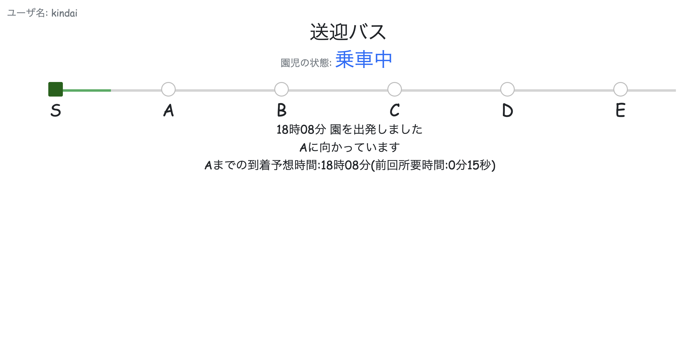

# 園児とバスのみえる化システム
## プロトタイプ概要

送迎バスのICT化として、送迎バスの位置と、乗り降りした園児の数を把握するシステムを構築した。

これにより、保護者が送迎バスを待つ時間を減らし、送迎バスにおける置き去り問題を解決する。

カードタッチの仕組みを導入するため、専用デバイスとRFIDセンサーを用いている。

#### ディレクトリ:
- M5Stack 
小型IoTデバイスであるM5StackのUIデザインなどを記述したコードが含まれる。[UIFlow](https://flow.m5stack.com/)（MicroPythonを使用した開発環境）においてM5Stackと接続して実行可能である。
- App
Pythonの軽量なウェブアプリケーションフレームワークであるFlaskを用いたコードが含まれる。

#### 使用機材
- M5Stack Core2 2台
- M5Stack用WS1850S搭載 RFIDセンサー 1台


#### 使用技術

##### バックエンド
- Python 3.9.12
- Flask 2.3.2
- SQLite 3.38.3

##### フロントエンド
- HTML
- CSS
- JavaScript
- Bootstrap 5.3
- UIFlow 1.13.4


## 実行方法
M5Stack、RFIDセンサー、PCを接続し、UIFlowの画面にてm5fファイルを実行する。

ブロック内のurlの記述、Wifi接続に必要なSSID、PASSWORDの記述は実行環境により異なるため、適切な値を入力する。

Appディレクトリに移動し、以下を実行する。
1. 仮想環境の作成・起動
```
python3 -m venv venv && source venv/bin/activate
```
2. 必要なライブラリのインストール
```
pip3 install -r requirements.txt
```
3. sqliteの初期化とマイグレーション
```
flask db init && flask db migrate && flask db upgrade
```
4. 環境変数を記述したサンプルである.env.exampleの内容を確認し、.envファイルを作成する。
```
FLASK_APP=
FLASK_DEBUG=
SECRET_KEY=
WTF_CSRF_SECRET_KEY=
```
5. サーバー起動
```
flask run --host=0.0.0.0
```
## システムの流れ
#### 停止中
- 送迎開始時にstartボタンを押す
- 同時にカードタッチの仕組みも別の端末で起動しておく


#### 送迎開始
- 視覚的なゲージを用いて、送迎バスの位置が表示される
- 次の地点の到着予想時刻も合わせて表示される



#### 地点通過
- M5Stack上のforwardボタンを順次押していく
- M5Stackの操作に合わせてwebページが更新される


#### カードタッチ
- 画面に園児の名前が表示され、乗車人数が更新される。
- 乗車時と降車時の切り替えは画面上のボタンで行う。


#### 最後のバス停
- 最後のバス停に到着すると、画面上部にcompleteボタンが生成される。
- completeボタンを押すと、サーバー側で乗車している園児がいないか照会する


#### 送迎終了
- 置き去りがない状態で、completeボタンを押すとバスの運行が正常に終了し、運行開始前の状態に戻る。
- 降車のカードタッチを行っていない園児がいる、すなわち、置き去りが発生している場合には、その園児の名前が表示される。
- その場合、第三者による二重チェックを行う。それでも見つからない場合、降車のカードタッチ処理後、再度completeボタンを押すことで送迎が完了する。


#### 認証機能
- プライバシー保護の観点や変質者に悪用される可能性を考慮し、未認証のユーザーに対しては、位置情報を表示しない。
- 園児の乗車状況をカードタッチにより的確に把握し、園児それぞれの乗車記録を反映させたwebページを表示させる。


### システム構成
M5Stackは送迎バスのドア近くにRFIDセンサーと共に設置し、もう一台は保育士の側に設置する。

システムの概要と、送迎バス運行終了時の流れを、発表スライドに掲載したものを用いて以下に示す。


## プロジェクト概要
2年次に開講された通年授業である社会情報学実習において、学生が5人一組のグループとなって行った企業連携型プロジェクトである。

この授業では、実際に企業が直面している課題に即したテーマに取り組んで、具体的な解決策を提案し、プロトタイプの開発を行う。

#### 与えられたテーマ:
企業が自社開発するこども園（保育園/幼稚園）ICTシステムの追加機能の提案を行う

## 解決する問題・システム化の背景
自分たちのグループが着目した課題は、送迎バスの位置・到着時刻を知りたいという保護者からの要望と送迎バス置き去り問題の2つである。

### 🔹 送迎バスのおよその到着時刻を知りたい
クオリテック株式会社によって行われた[送迎バスを利用する子どものいる母親約1000人を対象に、送迎バスに関するアンケート調査](https://prtimes.jp/main/html/rd/p/000000001.000053524.html)の結果が以下の通りである。

> - 遅れていると不安になる（20代／パート・アルバイト／福岡県）
> - 夏の暑い日や冬の寒い日の待ち時間が辛い（30代／会社員／東京都）


### 🔹 送迎バス置き去り問題
置き去り事件に関して、保育施設側に報告を求めていない自治体が多いため、全国的な件数を知ることは困難である。

一方で、[大阪府が公表したデータ](https://www.pref.osaka.lg.jp/kyoikusomu/homepage/okizarijiann.html)によると、2017年から2022年までの6年間の間に発生した府内の学校施設において、送迎バス内の置き去り事案の発生件数は19件とされている。

2022年には静岡県で園が人数の確認を怠ったことにより、3歳の女児が死亡した悲惨な事故も発生しており、社会的な問題となっている。

## 改善点
- 製品化する予定はないため、テストプログラムを記述していない。
- 今回、到着予想時刻の計算には前回の地点間における所要時間のみを利用しているが、AIを用いて、蓄積した所要時間データの傾向から到着時刻を予測することができれば興味深いと思った。
